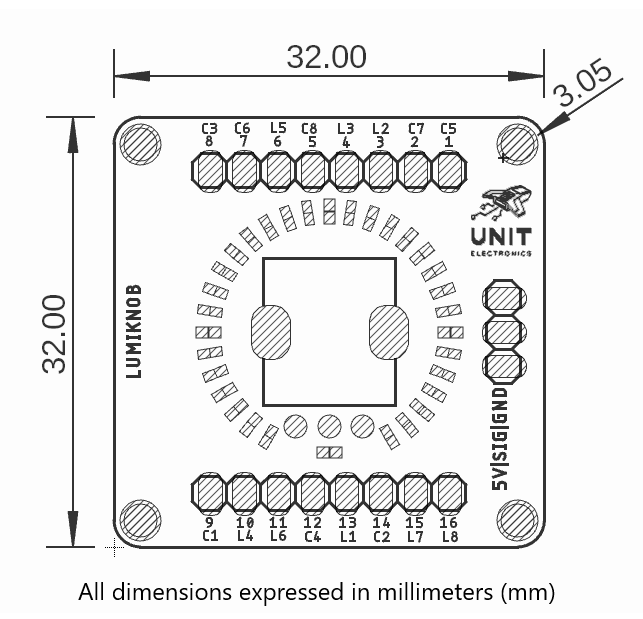

# Hardware

<a href="resources/img/Schematics_icon.jpg">  Schematics</a>

---

## ⚙️ Technical Specifications

## 🔌 Pinout

    <a href="resources/v_0_0_2/unit_pinout_v_0_0_2_ue0051_lumiknob_en.jpg">  Pinout</a>
     
     
     
    

| Module    | Pin | Microcontroller | Description                          |
|-----------|-----|-----------------|--------------------------------------|
| Lumiknob  | SIG | Analog pin      | Analog signal from the potenciometer |
| Lumiknob  | GND | Ground          | Ground reference                     |
| Lumiknob  | VCC | 3V3             | Supply voltage                       |
| MAX7219   | VCC | 5V              | Supply voltage                       |
| MAX7219   | GND | GND             | Ground reference                     |
| MAX7219   | DIN | MOSI            | Serial data input to MAX7219         |
| MAX7219   | CLK | SCK             | Serial clock input to MAX7219        |
| MAX7219   | CS  | GPIO            | SPI control for MAX7219              |

## 📏 Dimensions

<a href="resources/v_0_0_1/unit_dimension_ue0051_lumiknob_v_0_0_1.png">  Dimensions</a>

## 📃 Topology

<a href="resources/v_0_0_1/unit_topology_v_0_0_1_ue0051_lumiknob.png">  Topology</a>
 
 

| Ref. | Description |
|------|-------------|
| R1   |             | 
| JP1  |             |
| JP2  |             |
| JP3  |             |

# References

- [Lumiknob Datasheet]()

> Important: resources / v_0_0_1 folder has the dimension and topology file, v_0_0_2 folder has the latest version of the pinout 