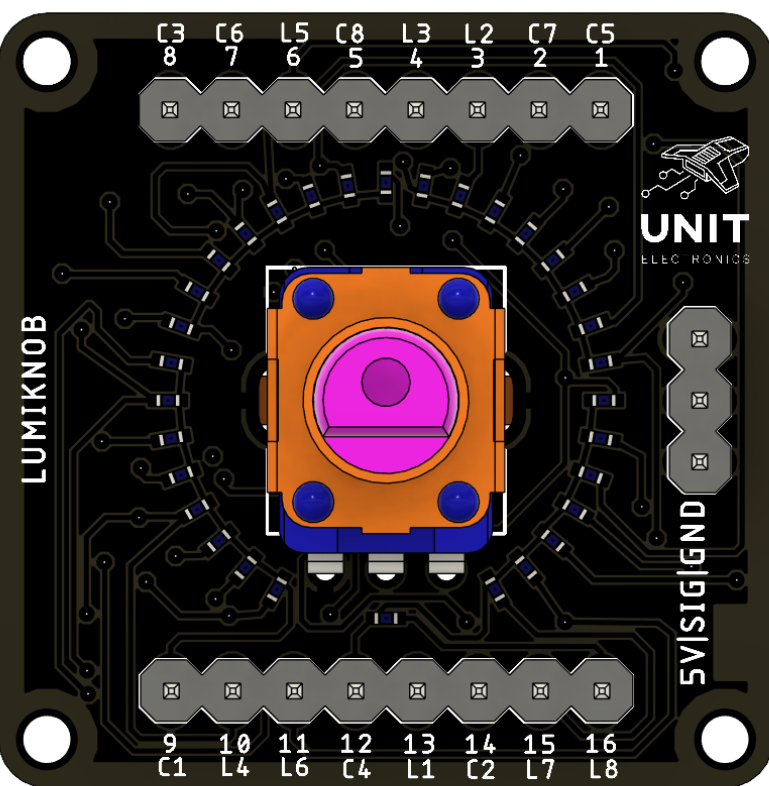

<!--
# README_TEMPLATE.md
Este archivo sirve como entrada para generar un PDF técnico estilo datasheet.
Edita las secciones respetando el orden, sin eliminar los encabezados.
-->
 <!-- logo -->

# cn3165_battery_charger_module

## Introduction

Lumiknob is a simple but powerful module that connects the analog world to digital displays. By turning a single potentiometer, you can control a series of up to 32 LEDs, thanks to the popular MAX7219 driver chip. With Lumiknob, creating intuitive rotary controls with bright, real-time visual feedback is easy—no complex programming or hardware hacking required.

## Functional Description

- **Lumiknob** is a compact module designed to drive up to 32 LEDs using a single potentiometer.
- It utilizes the **MAX7219** LED driver to control the brightness and state of each LED.
- The module communicates with a microcontroller via **SPI**, allowing for easy integration into various projects.
- The potentiometer provides an analog input that is converted to a digital signal, which the MAX7219 interprets to adjust the LEDs accordingly. 

## Electrical Characteristics & Signal Overview

- **Power Supply**: 5 V or 3.3 V (depending on the microcontroller)
- **LED Driver**: MAX7219
- **Communication**: SPI interface for data transfer
- **Potentiometer**: 10 kΩ linear taper
- **LEDs**: Up to 32 individually addressable LEDs

## Applications

- LED-based user interfaces
- Decorative lighting systems
- Interactive displays
- DIY electronics projects
- Educational tools for learning about electronics and programming

## Features

- Supports up to 32 LEDs
- Simple SPI communication
- Adjustable brightness via potentiometer
- Compact design for easy integration

## Pin & Connector Layout

| Pin               | MCU             | Description                                        |
|-------------------|-----------------|----------------------------------------------------|
| VCC               | 5V/3.3V         | Power supply input (5 V or 3.3 V)                  |
| GND               | GND             | Ground connection                                  |
| SIG               | Analog pin      | Potentiometer signal input (analog)                |
| CLK               | SPI Clock       | SPI clock signal for MAX7219                       |
| MOSI              | SPI Data        | SPI data input for MAX7219                         |
| CS                | SPI Chip Select | SPI chip select signal for MAX7219              |

## Settings

### Interface Overview

| Interface  SPI| Signals / Pins            | Typical Use                                         |
|------------|----------------------------|-----------------------------------------------------|
| SPI        | CLK, MOSI, CS              | Communication with MAX7219 driver for LED control   |
| Potentiometer | SIG (analog input)        | Reads the position of the potentiometer for LED control |

### Supports

| Feature            | Description                                         |
|--------------------|-----------------------------------------------------|
| LED Control        | Up to 32 LEDs controlled via MAX7219               |
| Potentiometer Input | Reads analog value to adjust LED brightness        |
| SPI Communication  | Uses standard SPI protocol for data transfer       |
| Power Supply       | Operates at 5 V or 3.3 V                           |
| Microcontroller    | Compatible with most microcontrollers with SPI support |

## Block Diagram

## Dimensions

## Usage

Works with:

- Arduino interfaces (e.g., Arduino Uno, Mega, Nano)
- Raspberry Pi (via SPI interface)

## Downloads

- [Schematic PDF](docs/schematic.pdf)

## Purchase

- [Buy from UNIT Electronics](https://www.uelectronics.com)
