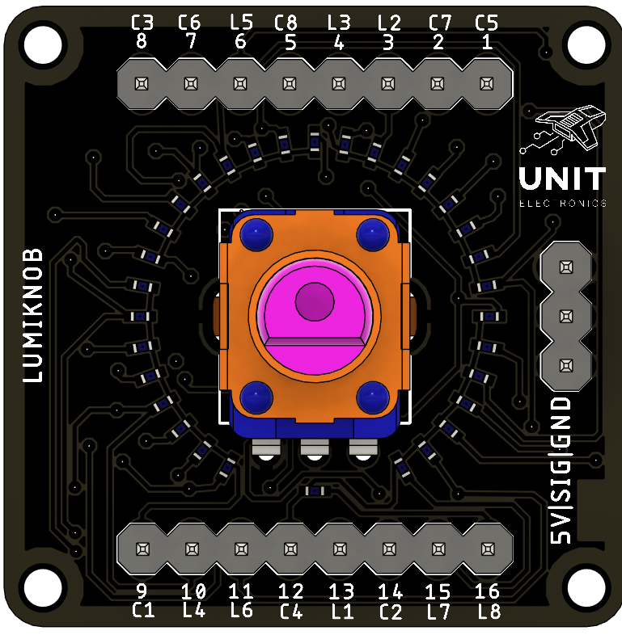
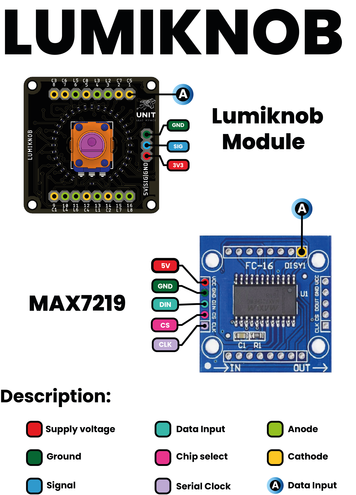
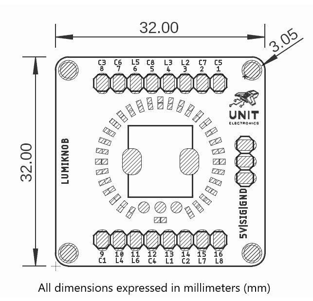

<!--
# README_TEMPLATE.md
Este archivo sirve como entrada para generar un PDF técnico estilo datasheet.
Edita las secciones respetando el orden, sin eliminar los encabezados.
-->
<!-- logo -->

# Lumiknob module

## Introduction

Lumiknob is a compact, plug-and-play module that combines an analog potentiometer with a digital LED driver to create a dynamic user interface element. It is designed to convert the rotation of a knob into a real-time visual representation using up to 32 LEDs, powered by the MAX7219 chip.

This module simplifies the task of translating analog input into meaningful visual feedback. Whether you are designing an interactive dashboard, building a learning tool, or prototyping control systems, Lumiknob offers a seamless way to visualize position, intensity, or progress through LED sequences or patterns.

Its design emphasizes simplicity and reliability—requiring just a few standard SPI connections to your microcontroller. The analog signal is read, processed, and instantly reflected on the LED array. Because the module offloads LED control to the MAX7219, developers can focus on the behavior logic without dealing with low-level timing or multiplexing.

## Functional Description

- Lumiknob integrates a potentiometer with a MAX7219 LED driver to provide real-time LED control.
- The analog signal is read by a microcontroller and mapped to a digital output pattern for the LEDs.
- Communication with the MAX7219 is handled over SPI, requiring minimal wiring and resources.
- The module is optimized for simplicity and quick integration with Arduino, Raspberry Pi, and other microcontrollers.

## Electrical Characteristics & Signal Overview

- Power Supply: 5 V or 3.3 V (compatible with common MCU voltages)
- LED Driver: MAX7219
- Communication: SPI (MOSI, CLK, CS)
- Potentiometer: 10 k ohm linear taper
- LEDs: Supports up to 32 individually addressable LEDs in a chain

## Applications

- LED-based user interfaces
- Interactive displays and dashboards
- DIY electronics and maker projects
- Educational tools for analog-to-digital signal demonstration
- Control systems with rotary feedback

## Features

- Controls up to 32 LEDs from a single analog source
- Compatible with SPI-enabled microcontrollers
- Adjustable brightness and patterns via firmware
- Minimal component footprint for compact enclosures

## Pin & Connector Layout

| Pin  | MCU       | Description                                   |
|------|-----------|-----------------------------------------------|
| VCC  | 5V/3.3V   | Power supply input                            |
| GND  | GND       | Ground reference                              |
| SIG  | Analog    | Analog input from potentiometer               |
| CLK  | SPI Clock | Clock line for MAX7219                        |
| MOSI | SPI Data  | Data line for MAX7219                         |
| CS   | SPI CS    | Chip select for MAX7219 communication         |

## Settings

### Interface Overview

| Interface     | Signals / Pins      | Typical Use                                   |
|---------------|---------------------|-----------------------------------------------|
| SPI           | CLK, MOSI, CS       | MAX7219 control interface                     |
| Potentiometer | SIG (analog input)  | Reads position for LED visualization          |

### Supports

| Feature             | Description                                          |
|---------------------|------------------------------------------------------|
| LED Control         | Up to 32 LEDs driven by analog input                 |
| Potentiometer Input | Converts analog value to visual LED output           |
| SPI Communication   | Uses SPI protocol for LED driver control             |
| Power Supply        | 3.3 V or 5 V input compatibility                     |
| Microcontroller     | Works with Arduino, STM32, Raspberry Pi, and others  |

## Block Diagram

## Dimensions

## Usage

Works with:

- Arduino interfaces (Uno, Mega, Nano)
- Raspberry Pi via SPI
- STM32, ESP32, and other microcontrollers with analog input and SPI support

## Downloads

- [Schematic PDF](../../hardware/unit_sch_v1_1_0_ue0051_lumiknob.pdf)

## Purchase

- [Buy from UNIT Electronics](https://www.uelectronics.com)
